# SFTi-Pennies System Architecture

Complete system diagram showing all components, workflows, and data flow.

## 🏗️ High-Level Architecture

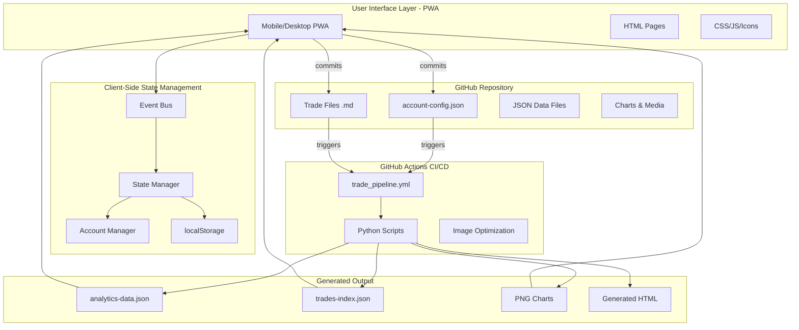

## 📊 Complete Data Flow

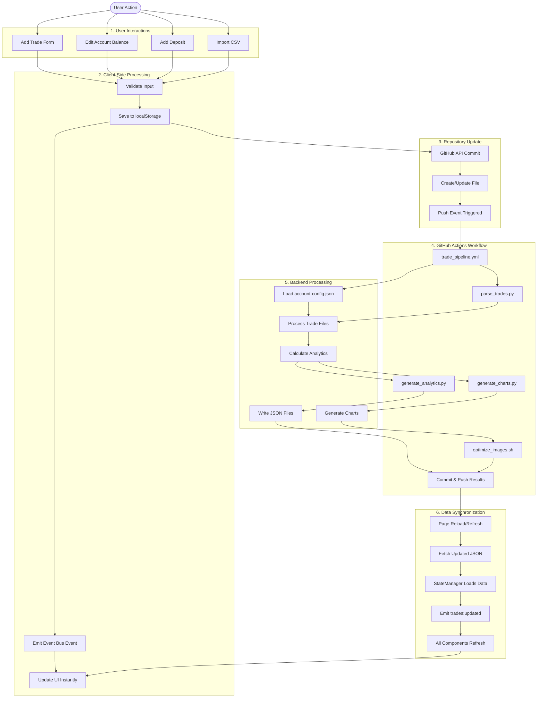

## 🔄 Event Bus Architecture

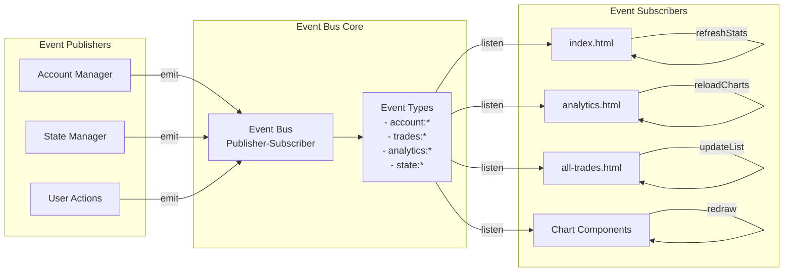

## 💾 Data Storage & Persistence

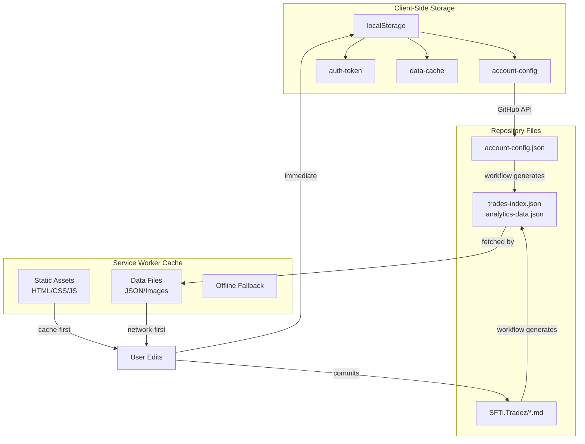

## 🎯 Trade Processing Pipeline

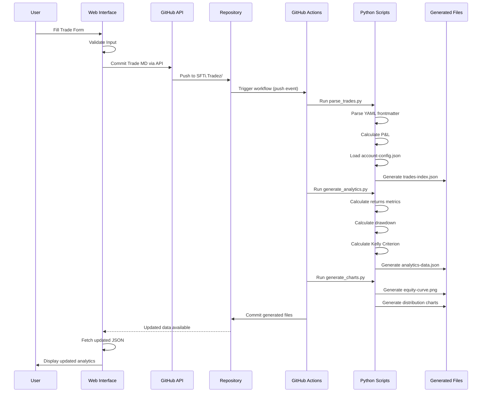

## 📱 Account Balance Update Flow

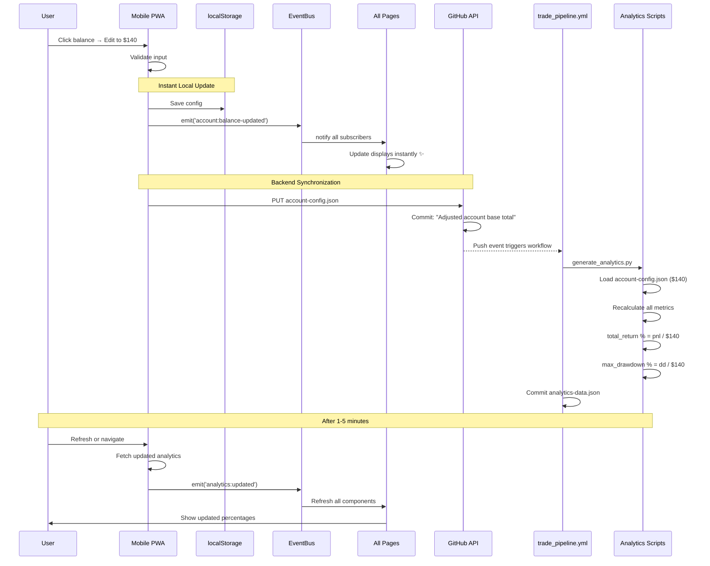

## 🔐 Authentication & API Flow

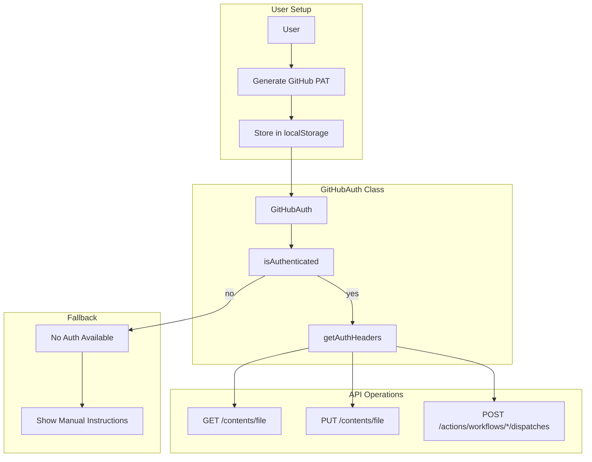

## 📊 Analytics Calculation Flow

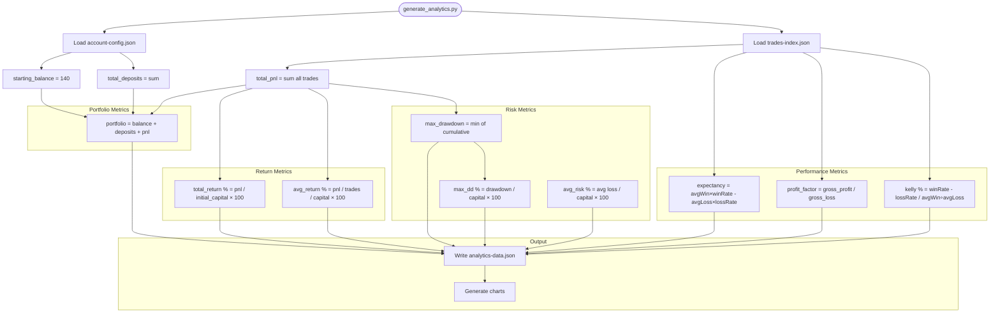

## 🌐 PWA Architecture

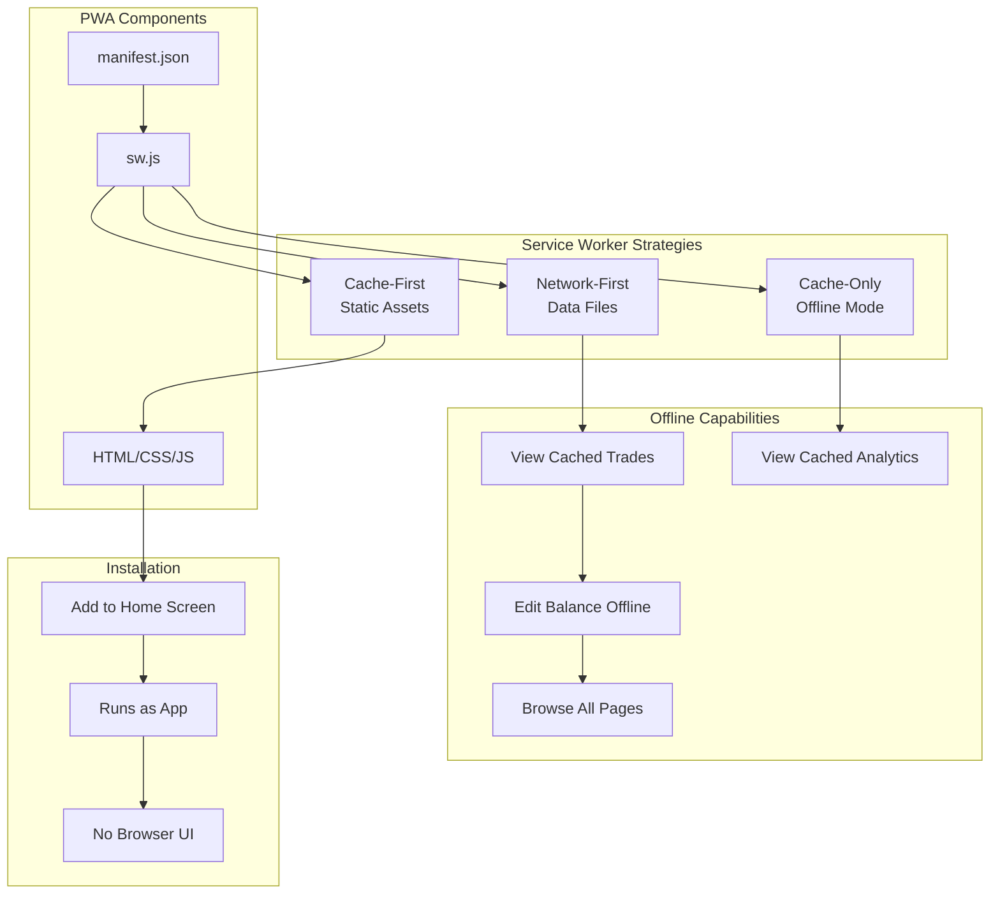

## 🔄 Workflow Trigger Paths

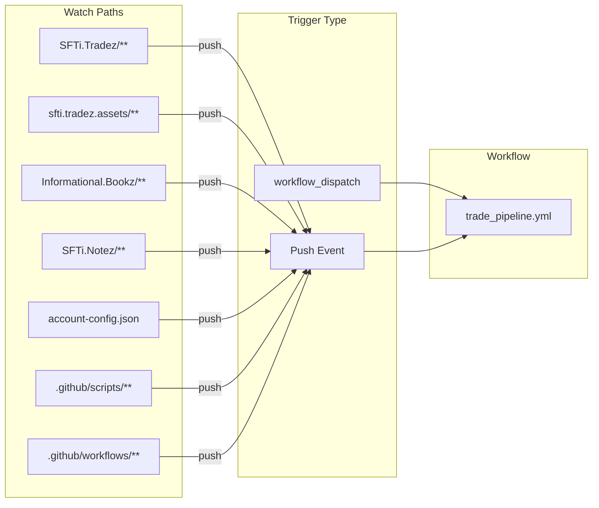

## 📈 Analytics Dashboard Components

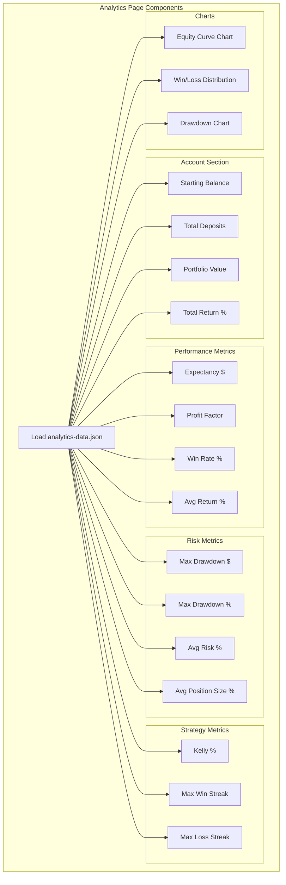

## 🎯 Complete Feature Map

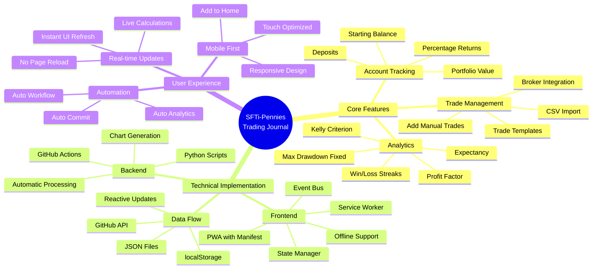

## 🔧 Script Dependencies

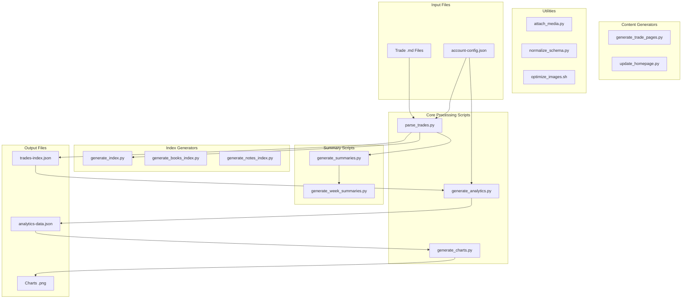

---

## 📝 Summary

This system architecture diagram shows:

1. **Complete data flow** from user actions to backend processing to UI updates
2. **Event-driven architecture** with reactive state management
3. **PWA capabilities** with offline support and caching strategies
4. **GitHub Actions integration** for automated processing
5. **Account balance tracking** with automatic synchronization
6. **Analytics pipeline** with corrected calculations (Max Drawdown, Kelly, Expectancy)
7. **Real-time UI updates** without page reloads
8. **Mobile-first design** with GitHub Pages hosting

The system is **production-ready** and designed for **zero-cost deployment** on GitHub Pages with **full offline PWA capabilities** for mobile users.
