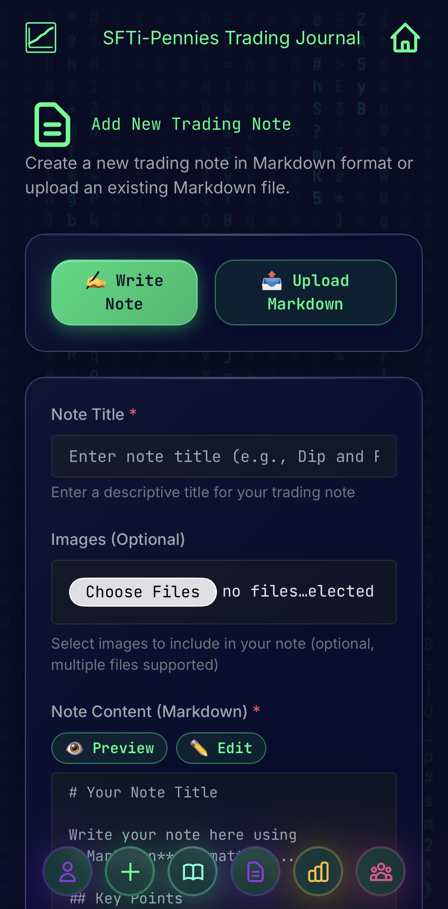
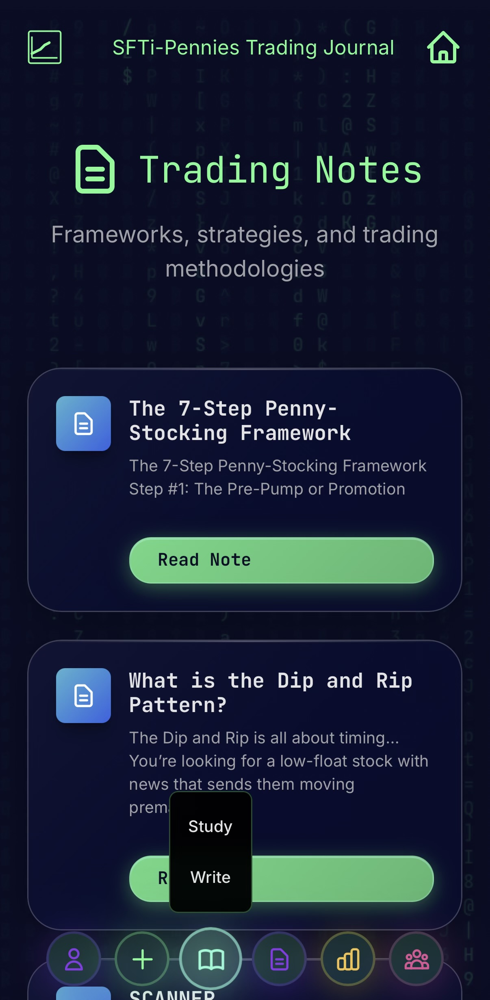
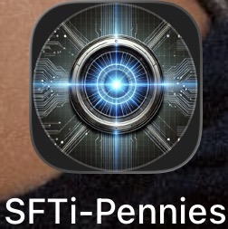

# 📈 SFTi-Pennies Trading Journal

**📁 You are here:** `/` (root)

---

## 🌟 Overview

Welcome to **SFTi-Pennies** - a comprehensive, fully automated trading journal system that combines cutting-edge web technology with professional penny stock trading methodology. This is not just another trading log; it's a complete ecosystem for tracking, analyzing, and improving your trading performance.

### ✨ What Makes This Special

- **🎨 Beautiful Dark UI** - Terminal-inspired interface with sparkling animations
- **📱 Mobile-First PWA** - Install on any device, works offline
- **🤖 Fully Automated** - GitHub Actions handle all processing and deployments
- **📊 Advanced Analytics** - Expectancy, profit factor, Kelly Criterion, max drawdown (all verified and production-ready)
- **💰 Account Tracking** - Starting balance, deposits, portfolio value with percentage-based returns
- **⚡ Real-Time Updates** - Reactive event system updates all pages instantly without reload
- **📥 Import/Export** - CSV import from major brokers (IBKR, Schwab, Robinhood, Webull)
- **📝 Weekly Reviews** - Structured review workflow for continuous improvement
- **📚 Integrated Library** - Books and notes management with PDF/Markdown viewers
- **🔗 Complete Ecosystem** - Part of the larger SFTi AI platform

### 🎯 Purpose Statement

Created a **fully transparent, organized trading account** with complete documentation of strategies, trades, education materials, and performance tracking to achieve **18 months to freedom**. 🚀

## 📱 Application Interface

### Mobile App Preview

<table>
<tr>
<td align="center" width="33%">

</td>
<td align="center" width="33%">

</td>
<td align="center" width="33%">

</td>
</tr>
</table>

*Progressive Web App with dark terminal theme and beautiful UI*

## 📚 Repository Architecture

### 🎯 Core Trading System

#### 1. [📚 index.directory/Informational.Bookz](./index.directory/Informational.Bookz/README.md)
**Trading Education Library** - PDF resources covering:
- 📖 10 Essential Chart Patterns
- 📖 20 Proven Trading Strategies  
- 🧠 7-Figure Mindset Psychology
- 💰 Profit Protection Techniques
- 🎓 Complete Penny Stock Course
- 💼 Advanced Hedge Fund Strategies

#### 2. [📝 index.directory/SFTi.Notez](./index.directory/SFTi.Notez/README.md)
**Trading Frameworks & Strategies** - Actionable trading plans:
- 🎯 [7-Step Penny Stocking Framework](./index.directory/SFTi.Notez/7.Step.Frame.md)
- 🔄 [GSTRWT Daily Workflow and Complete Trading Plan](./index.directory/SFTi.Notez/GSTRWT.md)
- 📊 [Top 5 Penny Indicators](./index.directory/SFTi.Notez/Penny.Indicators.md)
- 💹 [Dip and Rip Pattern](./index.directory/SFTi.Notez/Dip.n.Rip.md)

#### 3. [📊 index.directory/SFTi.Tradez](./index.directory/SFTi.Tradez/README.md)
**Live Trading Journal** - Real trades, real results:
- 📅 Weekly trade journals with daily entries
- 💹 Detailed P&L tracking and analysis
- 📸 Chart screenshots with annotations
- 📖 Lessons learned and improvement tracking
- 📈 Performance metrics and statistics

### ⚙️ Automation & Infrastructure

#### 4. [🤖 .github/scripts](./.github/scripts/README.md)
**Automation Scripts** - Python/Shell scripts that power the system (17 total):
- **Trade Processing**: `parse_trades.py`, `import_csv.py`, `export_csv.py`
- **Analytics & Charts**: `generate_analytics.py`, `generate_charts.py`
- **Summaries**: `generate_summaries.py`, `generate_week_summaries.py`
- **Indexing**: `generate_index.py`, `generate_books_index.py`, `generate_notes_index.py`
- **Content Pages**: `generate_trade_pages.py`, `update_homepage.py`
- **Utilities**: `attach_media.py`, `normalize_schema.py`, `navbar_template.py`
- **Build & Optimize**: `build.mjs`, `optimize_images.sh`
- **Broker Importers**: `importers/` module (IBKR, Schwab, Robinhood, Webull)

#### 5. [⚡ .github/workflows](./.github/workflows/README.md)
**CI/CD Pipeline** - Automated deployment system:
- Trade processing on every commit
- Automatic chart generation
- Image optimization
- GitHub Pages deployment

#### 6. [📋 .github/templates](./.github/templates/README.md)
**Content Templates** - Standardized formats:
- Trade entry template with YAML frontmatter
- Weekly summary template
- Consistent data structure

### 🎨 Frontend & Assets

#### 7. [🌐 Web Interface](./index.directory/)
**User-Friendly Pages** - Complete web application:
- 🏠 **index.html** - Homepage with recent trades and performance summary
- ➕ **add-trade.html** - Trade submission form with auto-calculations
- 📊 **analytics.html** - Advanced analytics dashboard with detailed metrics
- 📋 **all-trades.html** - Complete sortable trade listing
- 📅 **all-weeks.html** - Weekly performance summaries and navigation
- 🔄 **review.html** - Weekly trade review and summary completion tool
- 📥 **import.html** - CSV import interface for broker statements
- 📚 **books.html** - PDF library browser and viewer
- 📝 **notes.html** - Trading strategy notes and framework viewer
- ➕ **add-pdf.html** - Upload new trading books to library
- ➕ **add-note.html** - Create new trading strategy notes

#### 8. [🎨 index.directory/assets](./index.directory/assets/README.md)
**Visual Assets & Resources** - Organized media files:
- 📊 [Charts](./index.directory/assets/charts/README.md) - Generated performance charts
- 🖼️ [Icons](./index.directory/assets/icons/README.md) - PWA app icons
- 🎨 [CSS Styles](./index.directory/assets/css/README.md) - Dark terminal theme
- ⚡ [JavaScript](./index.directory/assets/js/README.md) - Client-side functionality
- 📸 [Trade Screenshots](./index.directory/assets/sfti.tradez.assets/README.md) - Trade charts
- 📚 [Framework Charts](./index.directory/assets/sfti.notez.assets/README.md) - Pattern examples

#### 9. [📚 .github/docs](./.github/docs/README.md)
**Comprehensive Documentation** - Complete guides:
- [Quick Start Guide](./.github/docs/QUICKSTART.md)
- [Developer Documentation](./.github/docs/README-DEV.md)
- [System Architecture](./.github/docs/STRUCTURE.md)
- [System Mermaid Diagrams](./.github/docs/SYSTEM-MERMAID.md) - **Complete visual system architecture**
- [Trade Pipeline](./.github/docs/TRADE_PIPELINE.md)
- [Analytics Documentation](./.github/docs/ANALYTICS.md)
- [Event Bus Integration Guide](./docs/EVENT_BUS_GUIDE.md)
- [Implementation Summary](./docs/IMPLEMENTATION_SUMMARY.md)

## 🚀 Quick Start Guide

### 🌐 For Visitors (View the Journal)

1. **📱 Visit the Live Site**: [statikfintechllc.github.io/SFTi-Pennies](https://statikfintechllc.github.io/SFTi-Pennies/)
2. **📊 Browse Recent Trades**: View latest trading activity on homepage
3. **📈 Deep Dive Analytics**: Check the analytics page for detailed performance metrics
4. **📅 Weekly Summaries**: Review weekly performance and all-weeks overview
5. **📚 Explore Education**: Access trading books and frameworks
6. **📝 Study Strategies**: Review trading notes and methodologies

### 📖 For Learners (Study the Method)

1. **Start with Education** → [Informational.Bookz](./index.directory/Informational.Bookz/README.md) - Foundation concepts
2. **Learn the Framework** → [7-Step Framework](./index.directory/SFTi.Notez/7.Step.Frame.md) - Pattern recognition
3. **Study the Workflow** → [GSTRWT Method](./index.directory/SFTi.Notez/GSTRWT.md) - Daily process
4. **Master Indicators** → [Penny Indicators](./index.directory/SFTi.Notez/Penny.Indicators.md) - Technical analysis
5. **Review Live Trades** → [SFTi.Tradez](./index.directory/SFTi.Tradez/README.md) - Real examples

### 💻 For Developers (Build Your Own)

1. **Read Setup Guide** → [Developer Docs](./.github/docs/README-DEV.md)
2. **Understand Architecture** → [System Structure](./.github/docs/STRUCTURE.md)
3. **Learn the Pipeline** → [Trade Pipeline](./.github/docs/TRADE_PIPELINE.md)
4. **Review Contributing** → [Contributing Guide](./.github/CONTRIBUTING.md)
5. **Clone & Customize** → Fork repo and adapt to your needs
6. **Deploy Your Version** → GitHub Pages automatic deployment

### 📈 For Active Traders (Use the System)

1. **Setup Authentication** → Generate GitHub Personal Access Token
2. **Add Your Trades** → Use the add-trade form with auto-calculations
3. **Import Broker Data** → CSV import from IBKR, Schwab, Robinhood, or Webull
4. **Review Performance** → Weekly review workflow to complete summaries
5. **Track Analytics** → Monitor expectancy, profit factor, and Kelly Criterion
6. **Export Data** → Download your trades as CSV for external analysis
7. **Manage Library** → Upload books and create trading notes

### 🎯 Essential Resources

| Resource | Purpose | Link |
|----------|---------|------|
| **🎯 7-Step Framework** | Core pattern recognition | [View](./index.directory/SFTi.Notez/7.Step.Frame.md) |
| **🔄 GSTRWT Method** | Daily workflow & scanning | [View](./index.directory/SFTi.Notez/GSTRWT.md) |
| **📊 Penny Indicators** | Top 5 technical tools | [View](./index.directory/SFTi.Notez/Penny.Indicators.md) |
| **📋 Trading Plan** | Complete strategy | [View](./index.directory/SFTi.Notez/Trade.Plan.md) |
| **💹 Dip and Rip** | Timing breakout patterns | [View](./index.directory/SFTi.Notez/Dip.n.Rip.md) |
| **📚 PDF Library** | Education materials | [View](./index.directory/Informational.Bookz/README.md) |
| **📊 Live Trades** | Real trade journal | [View](./index.directory/SFTi.Tradez/README.md) |

## 🎯 Trading Philosophy

This journal follows key principles:

- ✅ **Cut losses quickly** - Rule #1, always
- ✅ **Pattern recognition** - Focus on repeatable setups
- ✅ **Risk management** - Never risk more than you can afford to lose
- ✅ **Transparency** - Document everything, wins and losses
- ✅ **Continuous learning** - Review every trade, adapt and improve

## 📊 Journal Statistics

*This section will be updated as trades are logged*

- **Trading Period:** October 2025 - Present
- **Total Weeks Tracked:** 2
- **Trade Entries:** Multiple
- **Focus:** Penny stocks ($0.20 - $10 range)

## 🎨 Technology Stack

### Frontend
- **HTML5/CSS3** - Responsive, mobile-first design
- **Vanilla JavaScript** - No framework dependencies
- **Chart.js** - Interactive performance charts
- **PDF.js** - In-browser PDF viewing
- **Marked.js** - Markdown rendering
- **PWA** - Installable progressive web app

### Automation
- **GitHub Actions** - CI/CD pipeline
- **Python 3.11** - Data processing scripts
- **PyYAML** - YAML frontmatter parsing
- **Matplotlib** - Chart generation
- **esbuild** - JavaScript bundling

### Hosting & Deployment
- **GitHub Pages** - Free static hosting
- **Jekyll** - Static site generation
- **GitHub API** - Trade submission
- **Automated Workflows** - Zero-touch deployment

## 🔗 Quick Navigation

<table>
<tr>
<td width="50%">

### 📚 Content
- [📖 Education Library](./index.directory/Informational.Bookz/README.md)
- [📝 Trading Frameworks](./index.directory/SFTi.Notez/README.md)
- [📊 Trade Journal](./index.directory/SFTi.Tradez/README.md)
- [🎨 Visual Assets](./index.directory/assets/README.md)

</td>
<td width="50%">

### ⚙️ Development
- [🤖 Automation Scripts](./.github/scripts/README.md)
- [⚡ Workflows](./.github/workflows/README.md)
- [📋 Templates](./.github/templates/README.md)
- [📚 Documentation](./.github/docs/README.md)

</td>
</tr>
</table>

## 🌟 Key Features

<table>
<tr>
<td width="33%">

### 🎯 Trading System
- ✅ 7-Step framework
- ✅ GSTRWT workflow
- ✅ Indicator strategies
- ✅ Risk management
- ✅ Pattern recognition
- ✅ Weekly review workflow

</td>
<td width="33%">

### 📊 Advanced Analytics
- ✅ Automated P&L calculation
- ✅ Win rate & profit factor
- ✅ Expectancy calculation (verified)
- ✅ Kelly Criterion (verified)
- ✅ Max Drawdown (fixed and verified)
- ✅ Percentage-based returns
- ✅ Account balance tracking
- ✅ Deposit tracking
- ✅ Portfolio value calculation
- ✅ Equity curve charts
- ✅ Per-strategy breakdowns
- ✅ Drawdown analysis ($ and %)
- ✅ Win/loss streaks
- ✅ Real-time metric updates

</td>
<td width="33%">

### 🚀 Automation & Tools
- ✅ GitHub Actions pipeline
- ✅ Auto chart generation
- ✅ Image optimization
- ✅ CSV import/export
- ✅ Broker integration (IBKR, Schwab, Robinhood, Webull)
- ✅ PDF/Markdown management
- ✅ Zero-touch deployment

</td>
</tr>
</table>

## 📊 Trading Statistics

*Updated automatically via GitHub Actions*

- **📅 Trading Period:** October 2025 - Present
- **📈 Weeks Tracked:** 2+
- **💹 Focus:** Penny stocks ($0.20 - $10)
- **🎯 Strategy:** 7-Step Framework + GSTRWT
- **📊 Platform:** StocksToTrade, Interactive Brokers

## 🌐 External Links & Resources

### 🤖 SFTi AI Ecosystem
- **[SFTi AI Platform](https://www.sfti-ai.org)** - AI-powered trading tools and market analysis
- **[Ascend Institute](https://www.sfti-ai.org/ascend-institute)** - Advanced trading education and courses
- **[Live Trading Journal](https://statikfintechllc.github.io/SFTi-Pennies/)** - This journal's public site

### 📚 Learning Resources
- **[Timothy Sykes](https://timothysykes.com)** - Penny stock trading education
- **[Tim Bohen](https://www.leadtrader.com)** - StocksToTrade lead trainer
- **[StocksToTrade](https://stockstotrade.com)** - Trading platform and scanner

### 🛠️ Technical Resources
- **[GitHub Repository](https://github.com/statikfintechllc/SFTi-Pennies)** - Full source code
- **[Issues & Feedback](https://github.com/statikfintechllc/SFTi-Pennies/issues)** - Report bugs or request features
- **[Contributing Guide](./.github/CONTRIBUTING.md)** - How to contribute

## 📅 Latest Updates

**Current Week:** [Week 002](./index.directory/SFTi.Tradez/week.002/README.md)

**Recent Activity:**
- ✅ Automated trade processing
- ✅ Real-time chart generation  
- ✅ Mobile-optimized interface
- ✅ PWA installation support

## 📄 License & Attribution

**License:** MIT - See [LICENSE](./LICENSE)

**Author:** StatikFintech LLC  
**Repository:** [statikfintechllc/SFTi-Pennies](https://github.com/statikfintechllc/SFTi-Pennies)  
**Website:** [www.sfti-ai.org](https://www.sfti-ai.org)

---

**🎯 Trading Goal:** 18 months to freedom 🚀

**Last Updated:** October 2025

