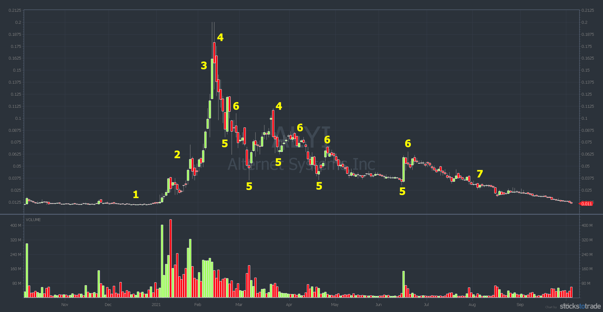
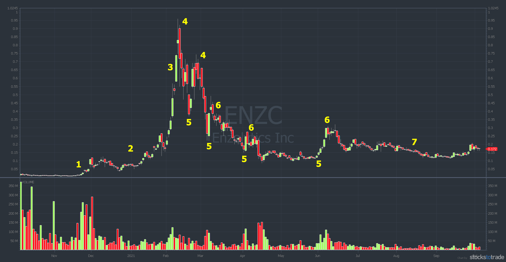
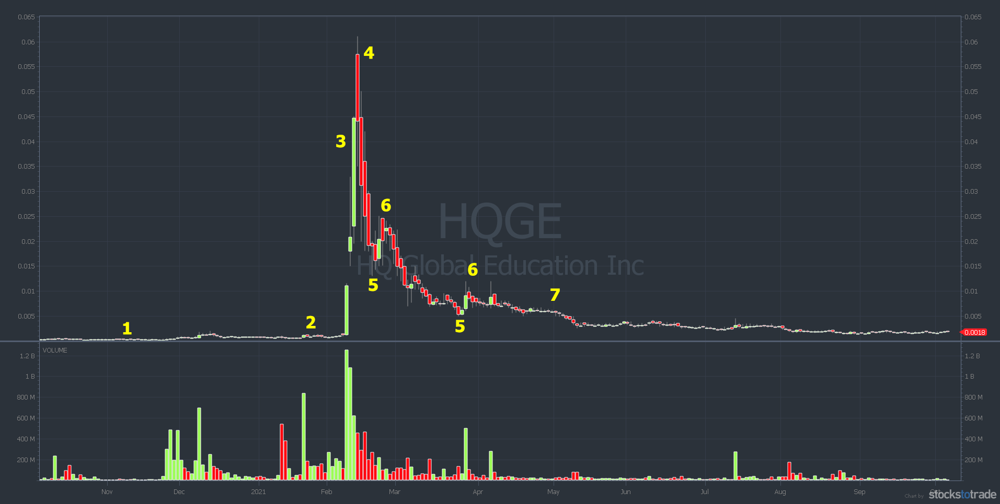
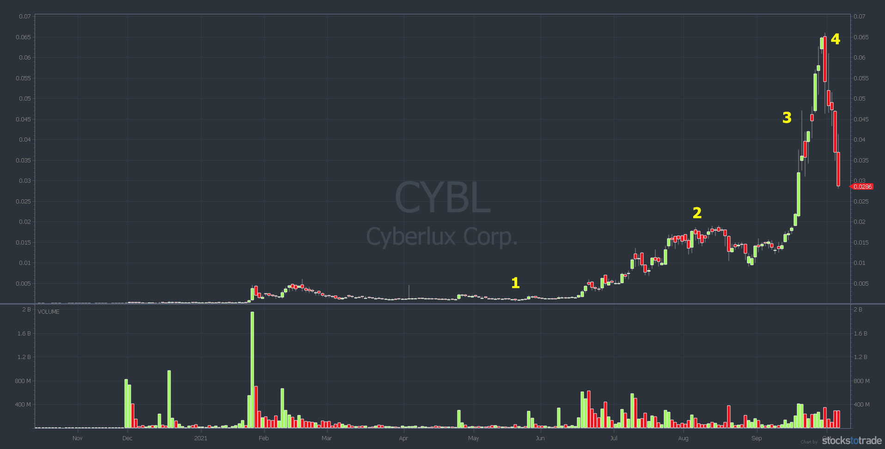
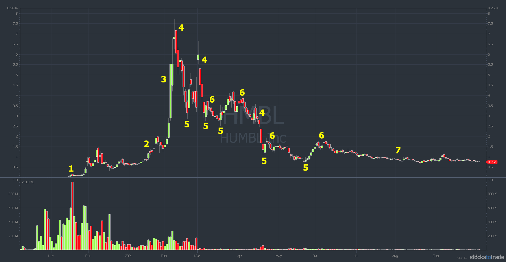
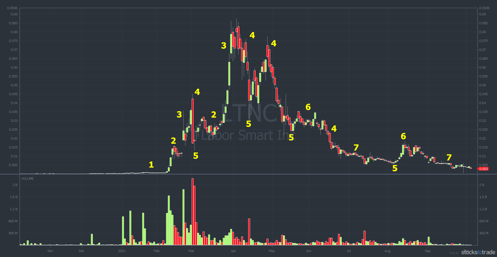
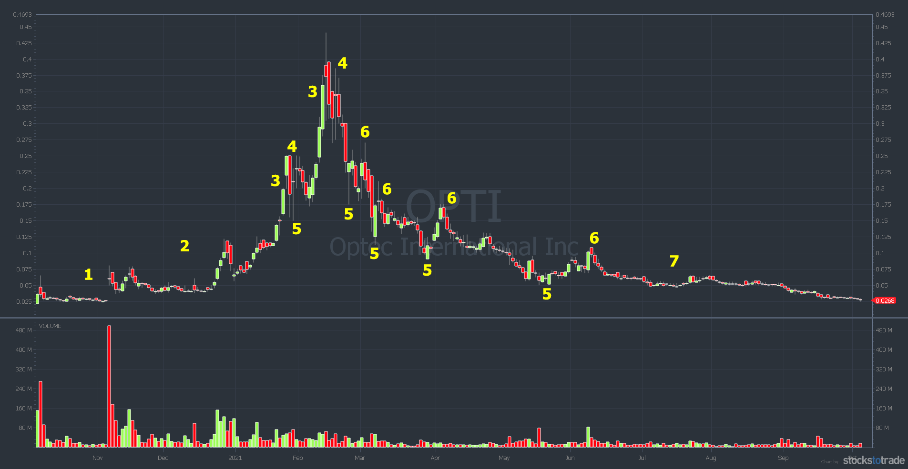

**The 7-Step Penny-Stocking Framework**

**Step #1**: The Pre-Pump or Promotion

> [!NOTE]
>
> ALYI chart: YTD October 6, 2021, 7-step pennystocking framework

At step #1, you can make big gains, but it takes time. The goal is to predict the huge spike ahead of time, regardless of the reason. This step is best for patient people with small accounts.

That said, it’s difficult to guess on plays like this. It’s tough without experience. Especially since the old-school email and mailer promotions pretty much died.

Jack Kellogg played the #1 with marijuana stocks in early 2021. He witnessed the sector run in 2017 and 2018. His thesis was that if Biden won the election, weed stocks would spike. In early January, he bought a group of weed stocks. Then, he waited.

Jack has spent years studying the 7-step pennystocking framework. He’s arguably the best student of the framework I’ve ever had. He crushed it in February after holding some of the stocks for nearly a month. Keep reading for a review of one of Jack’s trades.

   ------

**Step #2**: Ramp

> [!NOTE]
>
> ENZC chart: YTD October 6, 2021, 7-step pennystocking framework

In step #2, the run-up speeds up. There’s consolidation in anticipation of a breakout. Ideally, there’s sideways action and then a technical breakout. There’s often increased volume and more hype.

Back in the day, the hype came on message boards and emails. These days, it’s done by Twitter pumps and in chat rooms.

Students ask me how I know where the hype comes from. My go-to source is StocksToTrade Breaking News Chat. It saves me a ton of time. Use it.

Tip: Promoters use dozens, if not hundreds, of bot accounts on social media. Ride the hype, but don’t believe the BS. You’ve been warned.

When a stock is ramping, it’s possible to buy and hold for a few days or weeks. But again, you’re basically guessing that the promotion will work.

  ------

**Step #3**: Supernova

> [!NOTE]
>
> HQGE chart: YTD October 6, 2021, 7-step pennystocking framework

This is how I made my first $1 million back in 1999 and 2000. And to be honest, I didn’t understand what was happening. I just recognized the pattern and rode the wave. I bought the breakouts.

This is the most rewarding time to be long. But it’s also the riskiest. You MUST be aware that the higher a supernova goes, the more overextended it gets. Be very cautious with buying overextended stocks.

It all comes down to experience and practice. When you’re wrong (and you will be sometimes) always follow rule #1: cut losses quickly.

How long do you hold a supernova? That depends on a lot of things. Is the big move happening in one day? Or is it over multiple days? How many days has the stock been green? You have to consider many factors.

I recommend learning the first green day pattern. But also learn to use the seven indicators of the Sykes Sliding Scale. And be willing to adapt.

Remember, supernovas can flip on a dime.

  ------

**Step #4**: Cliff Dive

> [!NOTE]
>
> CYBL chart: YTD October 6, 2021, 7-step pennystocking framework – You know the old adage ... What goes up must come down.

The 7-step pennystocking framework came from observing price action on penny stock pumps. Back in the day, once a promotion stopped, the bottom fell out. Stocks sometimes dropped 50% or more in a day.

Fast-forward to today. Stock promoters might not use the same tools, but they still pump stocks. And when the promotion stops, the bottom still falls out. A small decline near the top turns into a full-on collapse.

This is the best time to short sell promotions. But it’s also usually the most difficult time to find shares to short. Why? When a stock goes from 50 cents to $5 over a few days, short sellers start circling like vultures. Especially if it’s based on promotion and hype.

We’ve seen many sub-penny plays go full supernova recently. So they might get up to 10, 20, or even 50 cents a share.

So before we get to step #5, there are two MAJOR caveats...

First, I think shorting is a flawed strategy right now. There are too many overaggressive newbie shorts in the market. It’s a risky strategy in a crowded space.

Second, I’d NEVER short an ultra-low-priced play. Even when I was short biased, I rarely shorted anything below $1. There had to be a good reason and/or proof of a pump.

But that’s OK because I’ve learned to adapt by playing...

   ------

**Step #5**: Dip Buy

> [!NOTE]
>
> HMBL chart: YTD October 6, 2021, 7-step pennystocking framework

The panic dip buy is my favorite pattern for small accounts. For me, this is the best time to buy a promoted stock. There’s still momentum and interest. The promoters tell their followers to hold, but a lot of newbies set hard stop-loss orders. When the stop losses get taken out, it becomes a self-fulfilling prophecy.

Often there’s a solid bounce for one or more of these reasons, depending on the stock’s price...

Dip buyers are waiting for the turn.
Short sellers buy to cover. Again, no big-time short seller is gonna short sub-penny stocks. Most won’t touch anything below 50 cents a share. The risk is too high.
Promoters try to create a soft landing so they don’t get investigated.
A stock can run 50% or more in a few hours or days. Sometimes the bounce happens in under an hour.

That means preparation is key.

How should you prepare? Learn to read Level 2 and use technical analysis. My DVD, “Learn Level 2” is a great place to start.

Tip: Reading Level 2 on listed stocks isn’t as straightforward as OTCs. With listed stocks, it’s more about technical analysis and reading the chart.

Again, sometimes the panic bounces, and sometimes it doesn’t. Don’t get stubborn. When in doubt, follow rule #1 and get out.

Be aware that the market ebbs and flows. Sometimes bounces work well. Other times, there are fakeouts and outright failures. Learn to avoid these three common mistakes when dip buying too early.

Remember, you MUST adapt.

   ------

**Step #6**: The Dead Pump Bounce

> [!NOTE]
>
> LTNC chart: YTD October 6, 2021, 7-step pennystocking framework

When I was short biased, this was my favorite time to short. Again, when a stock goes supernova, short sellers want to short it. But that’s risky because you have no idea how high it can go.

Once the stock has had a cliff dive and a bounce, short selling can be a little more predictable. That said, there’s not as much range. So while it’s easier to find shares to short, you’re not as likely to get a big percent win.

Also ... we’ve seen plays with two or more big spikes recently. Sometimes the bounces go right back to highs. Sometimes there’s no bounce at all.

Bounce or not, the next step is...

  ------

**Step #7**: The Long Kiss Goodnight

> [!NOTE]
>
> SHMP 3-year chart, 7-step pennystocking framework

Penny stock pumps don’t end with the company changing the world with its amazing product. They’re all junk. And that’s why step #7 happens. It’s a gradual decline over days, weeks, or months.

Look at the chart above. OPTI bounced several times. Like a bouncing ball, it eventually lost momentum.

—————————------—————————

