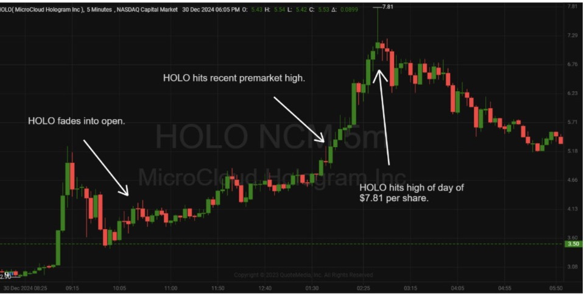
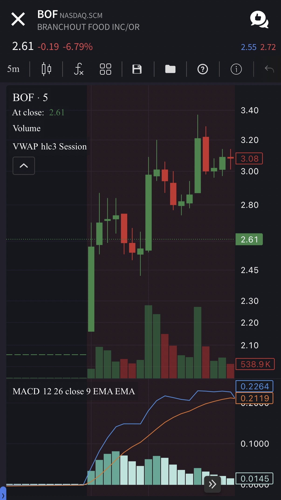

# What is the Dip and Rip Pattern?

The Dip and Rip is all about timing…

You’re looking for a low-float stock with news that sends them moving premarket.

These stocks attract attention, and that’s exactly what you want—because attention fuels momentum.

The “dip” phase occurs when the market opens. These stocks often fade as short sellers pile in, thinking the run is over.

The “rip” happens when buyers step back in, pushing the stock to new highs and forcing short sellers to cover.

This creates a domino effect of buying pressure, leading to explosive moves.

## Why This Pattern Works

The beauty of the Dip and Rip lies in its structure. It gives you:

**A Defined Entry:**
Enter when the stock breaks the previous high.

**Controlled Risk:**
Use the low of the day or VWAP as your stop.

**Fast Movers, Big Rewards**
Traders can reap big wins very quickly with these plays.

## Here’s the Criteria for Spotting Dip and Rip Setups

**Price Range:**
Focus on stocks between $1 and $10. They’re volatile but manageable.

**Percentage Gain:**
Only look at stocks up 50% or more in premarket. Anything less and you probably won’t see the price action you want later on.

**Volume:**
By 9:00 AM, the stock should have traded at least 3 million shares to ensure liquidity.

**Float:**
Stick to stocks with a float under 10 million shares. Low float equals big moves.

This is where float rotation comes in. Low-float stocks rotate quickly, and that’s what fuels those explosive moves. The higher the rotation, the better. Look for a minimum of 5X after the market opens.

## How to Trade the Dip and Rip

Once you’ve identified a potential Dip and Rip pattern, be patient.

Wait for the stock to dip at the open, then watch for it to reclaim the high of the day.

That’s your entry point.

Set your stop-loss just below the low of the day or a key support level like VWAP.

If the stock rips, let it run. No one ever sells perfectly at the top, but that’s not our goal.

We aim to find consistent and reliable setups that will grow your account over time.

## Examples

On December 30th, MicroCloud Hologram Inc. (NASDAQ: HOLO), a low float stock, had news in the morning which caused the stock to spike premarket.

It then faded into the open.

Around 1:00 PM CST, HOLO hit the high from premarket and proceeded to run up again to a high of $7.81 per share. This marked a gain of about 48%* in less than an hour.

> [!NOTE]
>
> HOLO Intraday, 5-Minute Candles Chart;
STT

On October 22, Branchout Food Inc (NASDAQ: BOF), a low float stock, had news in the early in the morning which caused the stock to spike premarket in the Image Perfect Dip n Rip

Around 6:30 AM CST, BOF hit the scanner on the first leg, and proceeded to run up again, and a third final time. This marked a gain of about 50%* in less than an hour.

> [!NOTE]
>
> BOF Pre-Market, 5-Minute Candles Chart;
IBKR