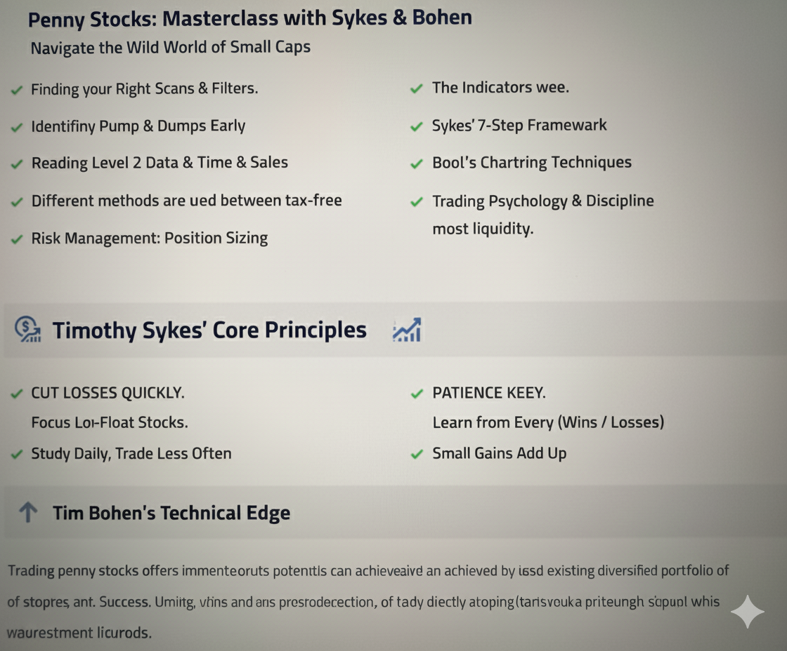

### G.S.T-R.W.T

 Grind.Scan.Trace.Research.Watch.Trade
 
  Build a watch list Daily

> [!IMPORTANT]
>
> Look left for recovery of Bearish trend  
> Look left for history of multi-day runs and look for history of a supernova  
> Looking for First or second Green Day  

**Grind**: Wake Up before the algos, before anyone else, put in the work they don't.  
**Scan**: Use the filters and scanners available.  
**Trace**: Look at the history, look at the patterns, be patient.  
**Research**: Look for news, look it up.
**Watch**: Watch the chart, watch resistance, watch reversals.  
**Trade**: Once you are confident, all boxes check, Make the Trade.

 Grind.Scan.Trace.Research.Watch.Trade

- Scan: Low Float <5m with Rotation
- If possible Float  <1m with Rotation
- Scan For News or S.E.C(Catalyst)
- Look for +10% Gainers
- Don't Jump on anything
- Let the trade come to you
- Watch the Dip and Rip
- Watch the Short Squeeze
- Monitor multi-day Runners
- Determine Support and Resistance
- Determine Entry Price
- Always set 10%~20% Trailing Stop
- Always set Stop Order for Max Gain

**SCANNER**
- Price Range $0.2-$10 (Ideal $1-$3)
- FIND SOMETHING MOVING UP
- VOLUME VOLUME VOLUME
- Float under 50M ideal
- Average volume preferably under the float
- LET THE MF BREAK OUT-PATIENCE
- FORMER RUNNERS(REPEATS ALOT)
- CATALYST(News, S.E.C, +Earnings)
- Breakout Pattern(s)

### Trading Plan

**THE TARGET**:  
  - The *Dip n Rip*(1-2 tight red ticks)
  - VWAP HOLD/BOUNCE
  - Stocks coiling about to Rip.
    
**Indicator_Strategy_1**:  
VWAP, MACD, EMA 25-SMA 70 & 200-BOLL

**Indicator_Strategy_2**:  
EMA 25-SMA 70 & 200-BOLL-MACD-SO

**Indicator_Strategy_3**:  
EMA/SMA 70-BOLL-MACD-SO

  ✅Stay Ahead of the Fuckin Market✅ 
------
  🚫🚫🚫🚫🚫🚫🚫🚫🚫🚫🚫🚫🚫  
 🚫APPLE,NVDA,TSLA,MSFT,GOOG🚫  
  🚫🚫🚫🚫🚫🚫🚫🚫🚫🚫🚫🚫🚫

—————————------—————————

