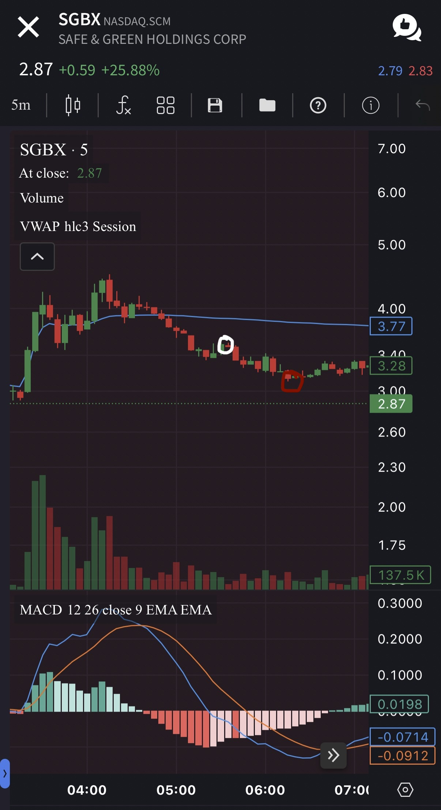
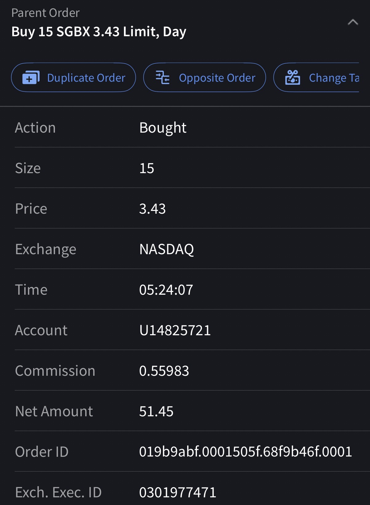
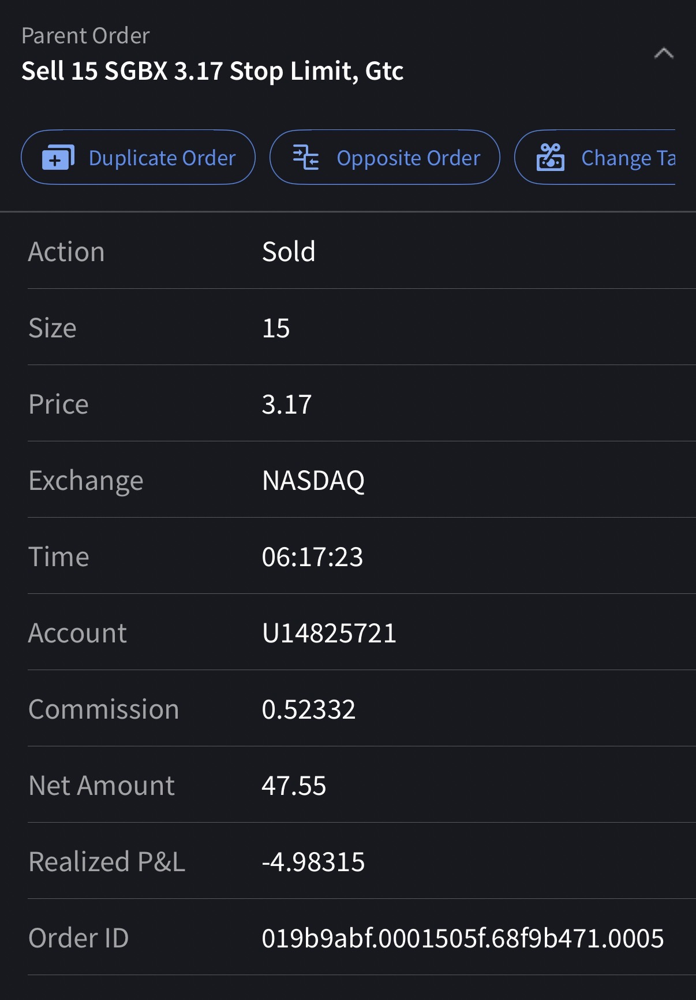

# Trade #1 - SGBX

## Trade Details

- **Ticker**: SGBX
- **Direction**: LONG
- **Entry**: $3.43 on 2025-10-23 at 17:24
- **Exit**: $3.17 on 2025-10-23 at 18:17
- **Position Size**: 15 shares
- **Strategy**: Dip Buy for a VWAP Test
- **Broker**: IBKR

## Risk Management

- **Stop Loss**: $3.17
- **Target Price**: $3.80
- **Risk:Reward Ratio**: 1:1.42

## Results

- **P&L (USD)**: $-3.90
- **P&L (%)**: -7.58%

## Notes

The trade was an unsuccessful attempt to execute the Step #5 Dip Buy. The stock had previously peaked above $4.20 and was in a strong Cliff Dive Step #4. The entry at $3.43, 05:24:07, was below the session VWAP of $3.77, identifying the correct area of value for a bounce attempt. However, the anticipated buying pressure failed to appear, and the price continued to bleed lower. The trader correctly utilized the stop-limit order, exiting at $3.17, 06:17:23, for a controlled loss of -$4.98. This outcome, while a loss, is a successful display of risk management, as it prevented a small loss from escalating into a larger one as the stock continued to decline toward $2.87.

## Screenshots

