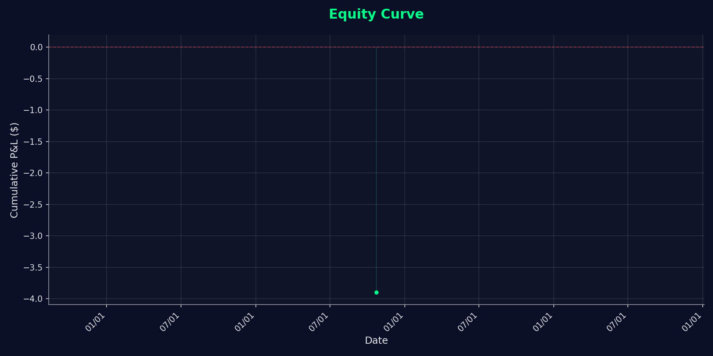

# Performance Charts

**📁 Location:** `/index.directory/assets/charts`

## Overview

This directory contains automatically generated performance charts and analytics visualizations for the trading journal. Charts are created by the `generate_charts.py` script during the GitHub Actions pipeline and update automatically whenever trades are added or modified.

## 📊 Generated Charts

All charts are available in two formats:
1. **Interactive Chart.js Data (JSON)** - Used on the homepage with a dropdown selector
2. **Static PNG Images** - Generated when matplotlib is available

### Chart Selector Dropdown

The homepage (`index.html`) includes a dropdown menu that allows users to switch between different chart views:
- **Equity Curve** - Cumulative P&L over time
- **Trade Distribution** - Individual trade P&L breakdown
- **Performance By Day** - Average P&L by day of week
- **Ticker Performance** - Total P&L by stock symbol

All charts use the same Chart.js styling and can be switched dynamically without reloading the page.

### Equity Curve Charts

#### `equity-curve-data.json`
**Format:** JSON  
**Purpose:** Data source for Chart.js interactive equity curve

**Structure:**
```json
{
  "labels": ["2025-01-01", "2025-01-02", ...],
  "datasets": [{
    "label": "Equity Curve",
    "data": [0, 100, 250, ...],
    "borderColor": "#00ff88",
    "backgroundColor": "rgba(0, 255, 136, 0.1)"
  }]
}
```

**Used By:** Homepage equity curve widget, trade dashboard

---

#### `trade-distribution-data.json`
**Format:** JSON  
**Purpose:** Data source for Chart.js trade distribution bar chart

**Structure:**
```json
{
  "labels": ["Trade #1", "Trade #2", "Trade #3", ...],
  "datasets": [{
    "label": "P&L ($)",
    "data": [125.50, -45.25, 89.75, ...],
    "backgroundColor": ["#00ff88", "#ff4757", "#00ff88", ...],
    "borderColor": ["#00ff88", "#ff4757", "#00ff88", ...],
    "borderWidth": 2
  }]
}
```

**Used By:** Homepage chart selector, trade analysis

---

#### `performance-by-day-data.json`
**Format:** JSON  
**Purpose:** Data source for Chart.js day-of-week performance bar chart

**Structure:**
```json
{
  "labels": ["Monday", "Tuesday", "Wednesday", ...],
  "datasets": [{
    "label": "Average P&L ($)",
    "data": [85.50, -23.00, 156.75, ...],
    "backgroundColor": ["#00ff88", "#ff4757", "#00ff88", ...],
    "borderColor": ["#00ff88", "#ff4757", "#00ff88", ...],
    "borderWidth": 2
  }]
}
```

**Used By:** Homepage chart selector, trading pattern analysis

---

#### `ticker-performance-data.json`
**Format:** JSON  
**Purpose:** Data source for Chart.js ticker performance horizontal bar chart

**Structure:**
```json
{
  "labels": ["NVDA", "AAPL", "AMD", "TSLA", ...],
  "datasets": [{
    "label": "Total P&L ($)",
    "data": [421.50, 307.25, 156.25, -123.75, ...],
    "backgroundColor": ["#00ff88", "#00ff88", "#00ff88", "#ff4757", ...],
    "borderColor": ["#00ff88", "#00ff88", "#00ff88", "#ff4757", ...],
    "borderWidth": 2
  }]
}
```

**Used By:** Homepage chart selector, ticker analysis (top 20 tickers by total P&L)

---

#### `equity-curve.png`
**Format:** PNG Image  
**Size:** Typically 1200x600px  
**Purpose:** Static equity curve visualization

**Content:**
- Cumulative P&L over time
- X-axis: Trading dates
- Y-axis: Account value change ($)
- Dark theme with green/red coloring
- Generated via matplotlib

**Used By:** Embedded in summaries, social sharing

---

### Distribution Charts

#### `trade-distribution.png`
**Format:** PNG Image  
**Size:** Typically 800x600px  
**Purpose:** Visualize win/loss distribution

**Content:**
- Pie chart or bar chart of wins vs losses
- Win rate percentage
- Number of trades in each category
- Color-coded: Green (wins), Red (losses)

**Used By:** Weekly summaries, monthly reports

---

#### `performance-by-day.png`
**Format:** PNG Image  
**Size:** Typically 1000x600px  
**Purpose:** Daily performance breakdown

**Content:**
- Bar chart of P&L by trading day
- Shows daily winning/losing streaks
- Identifies best and worst trading days
- Dark background with accent colors

---

#### `performance-by-ticker.png`
**Format:** PNG Image  
**Size:** Typically 1000x600px  
**Purpose:** Stock-level performance analysis

**Content:**
- Which stocks performed best/worst
- Number of trades per ticker
- Average P&L per ticker
- Helps identify strong/weak patterns

---

## 🎨 Chart Styling

All charts follow the trading journal's dark terminal theme:

### Colors
- **Background:** `#0a0e27` (Deep navy)
- **Grid Lines:** `#2a3f5f` (Subtle gray-blue)
- **Profit/Win:** `#00ff88` (Terminal green)
- **Loss:** `#ff4757` (Alert red)
- **Text:** `#e0e0e0` (Light gray)
- **Accent:** `#00ff88` (Bright green)

### Typography
- **Font:** 'JetBrains Mono' for numbers
- **Size:** 12-16px for labels, 10px for ticks
- **Weight:** Medium (500) for emphasis

### Chart.js Configuration
```javascript
const options = {
  plugins: {
    legend: {
      labels: {
        color: '#e0e0e0',
        font: {
          family: 'JetBrains Mono',
          size: 14,
          weight: '500'
        }
      }
    }
  },
  scales: {
    x: {
      grid: {
        color: '#2a3f5f'
      },
      ticks: {
        color: '#e0e0e0',
        font: {
          family: 'JetBrains Mono',
          size: 10
        }
      }
    },
    y: {
      grid: {
        color: '#2a3f5f'
      },
      ticks: {
        color: '#e0e0e0',
        font: {
          family: 'JetBrains Mono',
          size: 10
        }
      }
    }
  }
};
// Dataset example:
const dataset = {
  label: 'Equity Curve',
  data: [0, 100, 250, ...],
  borderColor: '#00ff88',
  backgroundColor: 'rgba(0, 255, 136, 0.1)'
};
```

## 🤖 Automatic Generation

### When Charts Update

Charts are regenerated automatically by GitHub Actions when:
- ✅ New trades are submitted
- ✅ Trade data is modified
- ✅ Manual workflow trigger
- ✅ Push to `trades/` or `SFTi.Tradez/` directories

### Generation Script

**Script:** `.github/scripts/generate_charts.py`

**Process:**
1. Read `trades-index.json`
2. Calculate cumulative P&L
3. Generate Chart.js data
4. Create matplotlib static images
5. Save to this directory
6. Commit and push updates

**Dependencies:**
- `matplotlib` - Static chart generation
- `pyyaml` - Data parsing

### Example Usage
```bash
# Run manually (from repo root)
python .github/scripts/generate_charts.py

# Or via GitHub Actions
# Automatically triggers on trade updates
```

## 📊 Chart Data Sources

All charts derive from:
- **Primary:** `index.directory/trades-index.json`
- **Trades:** Markdown files in `index.directory/SFTi.Tradez/week.*/`
- **Summaries:** Generated summary files in `index.directory/SFTi.Tradez/summaries/`

### Data Points Used
- Entry/exit dates and times
- P&L in USD and percentage
- Position sizes
- Win/loss classification
- Trading strategies used
- Tickers traded

## 🎯 Usage Examples

### In HTML (Chart.js)

**Homepage with Chart Selector:**
```html
<select id="chart-selector">
  <option value="equity-curve">Equity Curve</option>
  <option value="trade-distribution">Trade Distribution</option>
  <option value="performance-by-day">Performance By Day</option>
  <option value="ticker-performance">Ticker Performance</option>
</select>

<div id="equity-curve-container">
  <canvas id="equity-curve-chart"></canvas>
</div>
<div id="trade-distribution-container" style="display: none;">
  <canvas id="trade-distribution-chart"></canvas>
</div>
<!-- Additional containers for other charts -->

<script src="index.directory/assets/js/charts.js"></script>
```

**Single Chart Example:**
```html
<canvas id="equity-curve"></canvas>
<script>
  fetch('/index.directory/assets/charts/equity-curve-data.json')
    .then(r => r.json())
    .then(data => {
      new Chart(document.getElementById('equity-curve'), {
        type: 'line',
        data: data
      });
    });
</script>
```

### In Markdown (Static Image)
```markdown

```

### In Summaries
```markdown
## Weekly Performance



*Chart updated automatically*
```

## 📈 Metrics Calculated

### Equity Curve Metrics
- Cumulative P&L ($)
- Running account balance
- Drawdown periods
- Peak account values
- Recovery periods

### Performance Metrics
- Total trades
- Winning trades / Losing trades
- Win rate (%)
- Average win / Average loss
- Profit factor
- Largest win / Largest loss
- Best day / Worst day

### Risk Metrics
- Maximum drawdown
- Average risk per trade
- Risk:Reward ratios
- Consecutive wins/losses

## 🔧 Customization

### Modifying Chart Appearance

Edit `generate_charts.py` to customize:

```python
# Change colors
plt.rcParams['axes.facecolor'] = '#0a0e27'
plt.rcParams['figure.facecolor'] = '#0a0e27'
plt.rcParams['text.color'] = '#e0e0e0'

# Change dimensions
fig, ax = plt.subplots(figsize=(12, 6))

# Change line styles
ax.plot(dates, equity, color='#00ff88', linewidth=2)
```

### Adding New Charts

1. Add chart generation logic to `generate_charts.py`
2. Save output to this directory
3. Reference in HTML/Markdown
4. Update this README

## 🐛 Troubleshooting

### Charts Not Generating
1. Check GitHub Actions workflow logs
2. Verify `trades-index.json` exists
3. Check matplotlib installation
4. Review script errors in logs

### Charts Not Displaying
1. Verify file paths in HTML
2. Check browser console for errors
3. Confirm files committed and pushed
4. Clear browser cache

### Incorrect Data
1. Verify trade data in markdown files
2. Check `parse_trades.py` output
3. Review `trades-index.json` content
4. Regenerate charts manually

## 📊 File Size Guidelines

- JSON files: < 50KB (typically 5-20KB)
- PNG images: < 200KB each
- Total directory: < 1MB

Keep file sizes reasonable for fast loading.

## 🔗 Related Documentation

- [Automation Scripts](../../../.github/scripts/README.md)
- [Trade Pipeline](../../../.github/docs/TRADE_PIPELINE.md)
- [Developer Guide](../../../.github/docs/README-DEV.md)
- [JavaScript Implementation](../js/README.md)

## Quick Links

- [📈 Main Journal](../../../README.md)
- [📊 Trade Journal](../../SFTi.Tradez/README.md)
- [🎨 All Assets](../README.md)
- [📚 Documentation](../../../.github/docs/README.md)

---

**Last Updated:** October 2025  
**Generated By:** `.github/scripts/generate_charts.py`  
**Update Frequency:** Automatic on trade submission  
**Purpose:** Performance visualization and analytics
